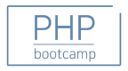

# PHP Bootcamp
### PHP Bootcamp in Study

PHP Camp에서 독학 + 코치를 통해 배우고 있는 
프로젝트입니다. Instargram 컨텐츠를 기본으로
PHP + Database 설계등 웹의 핵심기술을 학습하고 있습니다.

http://phpbootcamp.bookcafe100.com/course/self-study

# 기획 참고 자료 
### 과제 목록 :

https://docs.google.com/document/d/112pxsLec9MvixoBsAq5RY46zF-a6bFROWWWqkMbNDQ0/edit

### The Right Way : 모던 PHP의 정석.

http://modernpug.github.io/php-the-right-way/

# TEST ID : in This Application.

| Index | ID | Author |
|:---:|:---:|:---:|
| 1 | stonker@gmail.com | Leenara |
| 2 | highwind26@gmail.com | Leodays |
| 3 | highwind26@nate.com | Leedays |
| 4 | highwind26@naver.com | mangaLee |
| 5 | leosdays@gmail.com | leosdays26 |
| 6 | leechar@gmail.com | Leechar |
| 8 | yosemite@gmail.com | Yosemite |
| 9 | datetime@gmail.com | datetime |
| 10 | gmail@gmail.com | Gmail |
| 11 | daysmays@naver.com | maydays |
| 12 | stonker26@gmail.com | mailLee |
